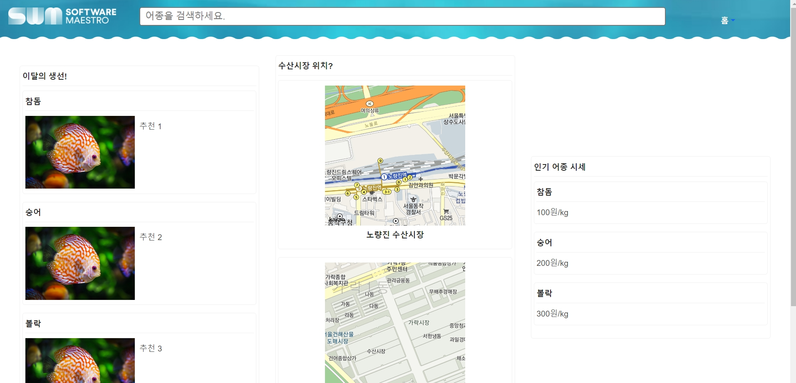

<!-- @format -->

# SW Maestro Hackathon - 파닥파닥 낚였닥

> SWM x GOORM IDE

> TODO: 링크

---

## 🖥 팀 소개

수산시장에서 부당한 가격으로 수산물 거래를 진행해보신 경험이 있으신가요? **파닥파닥 낚였닥**에서는 정부에서 제공하는 공공 API를 활용하여 여러분의 안전한 소비생활을 돕습니다. 인기어종 약 20종에 대한 일일 시세 정보와 유사 어종 등 다양한 정보를 지금 당장 만나보세요!

---

## 🔗 기술 스택

- #### [구름 IDE](https://ide.goorm.io/)
- #### [카카오 API](https://developers.kakao.com/)
- #### [공공데이터 API](https://www.data.go.kr/data/15058271/openapi.do)

---

## 📚 주요 기능

- #### 인기 어종의 시세 제공
- #### 어종 검색 기능 및 상세 데이터 제공
- #### 제철 수산물, 수산시장 위치 등 다양한 정보 제공

---

## 👩🏻‍💻 Members

- 황재현 : [**@hd1534**](https://github.com/hd1534)
- 김영석 : [**@Quartzes-KAIST**](https://github.com/Quartzes-KAIST)
- 고범석 : [**@kobeomseok95**](https://github.com/kobeomseok95)
- 이찬우 : [**@chanwooleeme**](https://github.com/chanwooleeme)
- 정승우 : [**@W1nU**](https://github.com/W1nU)
- 한영구 : [**@hd1534**](https://github.com/hd1534)

---

*이 성과는 2021년도 과학기술정보통신부의 재원으로 정보통신기획평가원의 지원을 받아 수행된 연구임(IITP-0000-SW마에스트로과정). This work was supported by the Institute of Information & Communications Technology Planning & Evaluation(IITP) grant funded by the Ministry of Science and ICT(MSIT) (IITP-0000-SW Maestro training course).*